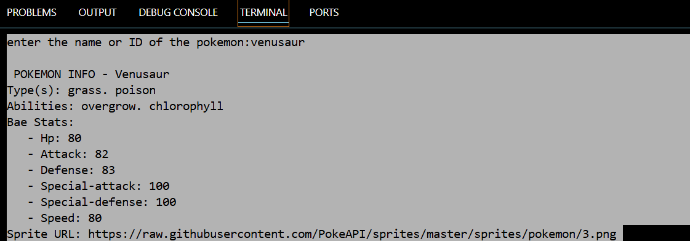
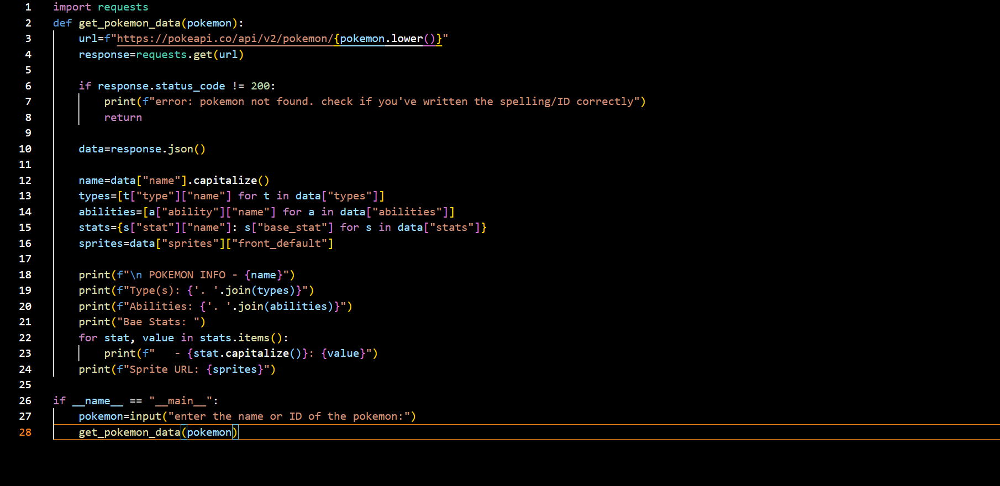

# Pokédex CLI — Python x PokéAPI

A simple command-line based Pokédex built using Python and the [PokéAPI](https://pokeapi.co/).  
Type a Pokémon's name or ID and get all its details with just a press of a button.

---

## Version

**v2.0 - September 2025**

New in this version:
- Added Main Menu system (Search, Compare, Exit)
- Comparison tool → Compare base stats of two Pokémon side-by-side
- Fuzzy search → Suggests close matches for misspelled Pokémon names
- Added colored terminal output for better readability
- Improved error handling & cleaner structure


**v1.5 – July 2025**

New in this version:
- Added flavor text (official Pokédex description)
- Shows generation and region
- Shows what the Pokémon evolves **from**
- Improved user input and error handling (asks again if Pokémon is not found)
- Cleaner formatting of height, weight, and stats


**v1.2 – June 2025**

New in this version:
- Added abilities to Pokémon details
- Prints sprite URL (front image) for reference
- Slightly improved output formatting


**v1.0 – June 2025**

New in this version:
- First working release of the CLI Pokédex
- Search Pokémon by name or ID
- Shows basic info: type(s), base stats, height, and weight
- Fetches live data from PokéAPI

---

Features: 

🔎 Search Pokémon by name or ID

📊 Displays detailed info:

    - Type(s)
    - Abilities
    - Base stats
    - Height & weight
    - Generation & Region
    - Evolution info (what it evolves from)
    - Official Pokédex flavor text

🌐 Pulls live data using PokéAPI

🎨 Prints sprite image URL for visual use

🧩 Main menu system → Navigate between search, compare, and exit

⚖️ Comparison tool → Compare two Pokémon’s base stats side by side

📝 Fuzzy search → Suggests close matches if name/ID is misspelled

🎨 Colored output (via colorama) for better readability in terminal

---

Building Blocks

Python 3.10+

Requests
→ Fetch Pokémon data from PokéAPI

Colorama
→ Colored terminal output

difflib (get_close_matches)
→ Fuzzy search suggestions

PokéAPI
→ Official Pokémon data source

---

## Screenshots

### 🔹 Terminal Output


### 🔹 Program Running


---

Installation Procedure

```bash
git clone https://github.com/arihvnt/Pokedex.git
cd Pokedex
pip install -r requirements.txt